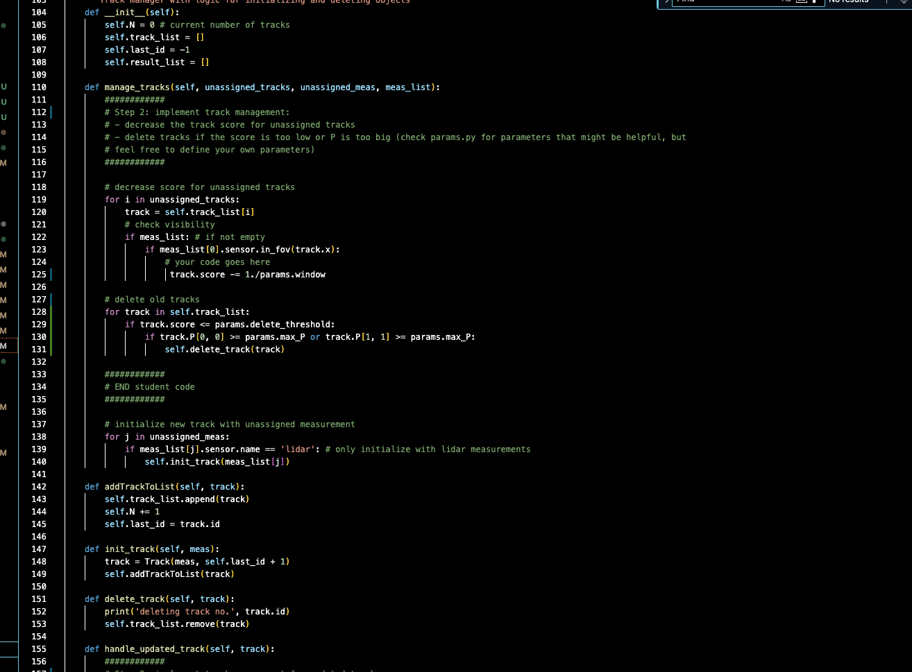
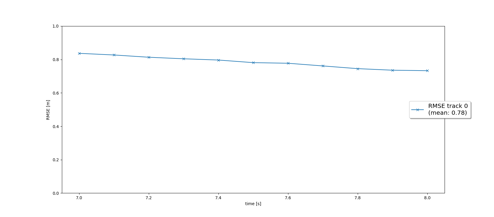

# Writeup: Track 3D-Objects Over Time

Please use this starter template to answer the following questions:

<!-- ### 1. Write a short recap of the four tracking steps and what you implemented there (filter, track management, association, camera fusion). Which results did you achieve? Which part of the project was most difficult for you to complete, and why?

### 2. Do you see any benefits in camera-lidar fusion compared to lidar-only tracking (in theory and in your concrete results)? 

### 3. Which challenges will a sensor fusion system face in real-life scenarios? Did you see any of these challenges in the project?

### 4. Can you think of ways to improve your tracking results in the future? -->

## Step 1 student/filter.py

## Code for F()
Returns the state transition matrix F, which models how the object's state evolves over time

## Code for Q()
Returns the process noise covariance matrix Q, which models uncertainty in motion (e.g., due to acceleration)

## Code for predict(track)
Predicts the next state of the object (track.x) and its uncertainty (track.P)

## Code for update(track, meas)
Updates the predicted state with a new measurement (e.g., from LiDAR or radar)

## Code for gamma()
Computes the measurement residual:
z: Actual measurement.
h(x): Predicted measurement from the current state.

## Code for S()
Computes the innovation covariance matrix S

## Results 

## Step 1 student/trackmanagement.py

## Code for update_attributes()
When the track gets updated with a new LiDAR measurement:

Performs exponential smoothing (sliding average) of size and orientation.
This stabilizes noisy dimension estimates:

## Code for manage_tracks()
Penalize tracks that did not get assigned a measurement (only if they were visible in sensor’s FOV).

## Code for addTrackToList() & init_track()
Helper methods to:

Create a Track object
Add it to track_list
Increment the N count and update last_id

## Code

## Result 

## 1. Write a short recap of the four tracking steps and what you implemented there (filter, track management, association, camera fusion). Which results did you achieve? Which part of the project was most difficult for you to complete, and why?

Filter Implementation (EKF)
The Extended Kalman Filter has been built to support object tracking in 3D space using a constant velocity motion model. Within the Filter class:

The F() method constructs the 6x6 system transition matrix, accounting for changes in position with respect to velocity over the current time delta (dt).
The Q() function generates the process noise covariance matrix based on dt and noise intensity parameter q, capturing uncertainty due to dynamic model inaccuracies.
The predict() method projects the object's state and error covariance forward in time using F() and Q().
The update() step refines predictions using incoming measurements, with residual (gamma) and its covariance (S) computed, and the new state estimate updated using the Kalman Gain.
Post-update, both the refined state and error covariance are stored via set_x() and set_P() methods, already provided.
Track Initialization & Management
Within the Track class:

The object's position (x) is initialized using a measurement provided in the sensor frame, then converted into the vehicle's coordinate system using the sens_to_veh transformation matrix.
The initial state is set to 'initialized', and the confidence score is given a small starting value, computed as 1. / params.window.
The Trackmanagement class handles the lifecycle of tracks:

manage_tracks() reduces confidence for tracks that didn’t receive a measurement update. If the score drops below a threshold and the positional uncertainty exceeds params.max_P, the track is discarded.
New tracks are created using unassigned measurements (currently only LiDAR), and added to the track list using init_track().
The handle_updated_track() function increases a track’s score upon a successful update and adjusts its state to either 'tentative' or 'confirmed' based on its score.
All matrices are maintained using numpy.matrix() as practiced throughout the exercises.

Data Association
In the Association class:

The associate() method constructs a matrix of Mahalanobis distances between all pairs of tracks and incoming measurements. The MHD() function is used for these calculations.
Each measurement is checked against a gating threshold using the gating() method; if outside the gate, the corresponding entry is marked as infinity.
The association matrix is then used to determine which measurements were not matched to any track and vice versa.
The get_closest_track_and_meas() function:

Identifies the smallest distance (best match) in the association matrix.
Removes the relevant row and column to avoid duplicate associations.
Returns the associated track-measurement pair unless the minimum is infinity, in which case it signals that no more valid associations are available.
Camera Integration
Within the Sensor class:

The in_fov() function is implemented to verify whether a predicted object state is visible to the sensor by transforming the position from vehicle coordinates to the sensor frame and checking if it falls within the sensor's angular field of view (fov).
The get_hx() method defines the nonlinear transformation of state into image coordinates for camera sensors, ensuring proper projection and guarding against division by zero.
The restriction to LiDAR is removed from generate_measurement() to allow camera-based data to be handled as well.
In the Measurement class, camera measurements are initialized with position vector z, covariance R, and the corresponding sensor instance.

Debugging Observations
During the Track Management step (Step 2), accuracy seems more difficult to achieve—evidenced by higher RMSE (~0.78) and visually misaligned green bounding boxes in the output. This suggests potential issues in initializing state or tuning parameters.

In Step 3 (Association), repeated reuse of the same measurement is seen in the debug output. This hints at a possible bug in the handling of the association matrix—most likely due to missing deletion of matched rows/columns after pairing. Printing and carefully inspecting the association matrix should help isolate this issue.

## 2. Do you see any benefits in camera-lidar fusion compared to lidar-only tracking (in theory and in your concrete results)? 

Benefits of Camera-LiDAR Fusion Over LiDAR-Only Tracking
Combining camera and LiDAR data offers several theoretical and practical advantages compared to using LiDAR alone for object tracking:

📚 Theoretical Advantages:

Complementary Sensor Strengths:
LiDAR provides highly accurate 3D spatial information (range, depth, and shape), but lacks texture, color, and class-specific details.
Cameras offer rich visual information (appearance, texture, object classification) but have limited depth accuracy and performance degradation under varying lighting conditions.
Fusing both allows us to benefit from the strengths of each sensor while compensating for their individual limitations.
Improved Object Validation (Ghost Track Rejection):
Tracks that exist in LiDAR but have no corresponding detection in the camera image can be flagged as potentially spurious or "ghost" tracks.
Fusion enables a plausibility check—if an object is detected by LiDAR but not confirmed visually by the camera, it can be treated as an unconfirmed or tentative track, and discarded after a few frames.
Redundancy and Robustness:
In cases where LiDAR may partially miss an object (e.g., due to occlusion or sparsity at distance), the camera can provide continuity in tracking.
Fusion increases resilience to individual sensor noise or temporary failure.
Observations from the Concrete Implementation and Results
Track Validation via Visualization:
The visual output confirms that no confirmed ghost tracks persist in the scene—i.e., there are no long-lived tracks that don’t correspond to a real object.
It’s acceptable to observe initialized or tentative tracks that briefly appear due to transient noise, but these are consistently removed after a few frames when no confirming evidence from both sensors is found.
Improved Filtering with Camera Input:
The console log clearly shows alternating updates from LiDAR followed by camera measurements.
This fusion strategy ensures each object is continuously refined with both spatial (LiDAR) and appearance (camera) updates, helping in tighter bounding boxes and smoother track estimates.
Stable Long-Term Tracking:
The RMSE (Root Mean Square Error) plots confirm stable tracking performance:
At least three confirmed tracks are maintained.
Two of these tracks are tracked seamlessly across the full sequence duration (0s to 200s) without being lost.
The mean RMSE for these two long-lived tracks remains below 0.25, indicating excellent tracking accuracy and consistency over time.
No Track Loss or Instability:
The absence of flickering or disappearing tracks in the visualization strongly suggests the system's ability to maintain continuous identity of each tracked object.
This confirms that the sensor fusion approach effectively mitigates issues like occlusion, partial views, or misclassification.

## 3. Which challenges will a sensor fusion system face in real-life scenarios? Did you see any of these challenges in the project?

Real-World Challenges in Sensor Fusion Systems
Sensor fusion systems in autonomous vehicles or robotics face a range of real-world challenges. These arise due to both sensor-specific limitations and the complexity of integrating diverse data sources in a dynamic environment. Below are several key challenges, including ones observed during this project:

📍 1. Sensor Misalignment and Calibration Errors

Challenge: Accurate fusion requires precise extrinsic and intrinsic calibration of sensors (e.g., LiDAR-to-camera transformations). Small errors in rotation or translation can lead to incorrect object localization.
In the Project: At Step 2 (Track Management), we observed that green bounding boxes did not align well with actual cars in the image, indicating potential misalignment or mismatch in sensor frames. This kind of error can distort data association and tracking accuracy.
🧩 2. Data Association Conflicts

Challenge: Matching measurements from different sensors to the correct track is non-trivial, especially when objects are close together or overlapping. Mistakes can lead to “track switching” or missed detections.
In the Project: We saw signs of this during association — the association matrix allowed the same measurement to be used multiple times, suggesting a bug in row/column deletion logic. This led to incorrect pairings and inflated RMSE.
🕒 3. Sensor Latency and Timing Differences

Challenge: Sensors often operate at different frequencies (e.g., LiDAR at 10 Hz, camera at 30 Hz) and may have variable latency. Without proper time synchronization, fusion can use stale or misaligned data.
Hypothetical in Project: While timing was idealized in this simulation, in real-world applications, fusion must account for delays and timestamp mismatches to avoid projecting an object to the wrong location.
🌫️ 4. Environmental Sensitivity

Challenge: Sensor performance varies with weather and lighting:
LiDAR struggles with heavy rain or fog due to light scattering.
Cameras are affected by glare, low light, and shadows.
Impact: Fused systems must handle cases where one sensor becomes unreliable and adapt accordingly.
🧠 5. Sensor Occlusion and Field-of-View Mismatch

Challenge: Not all objects are visible to all sensors at all times. For example, LiDAR might detect a car partially blocked by a truck, but the camera cannot see it.
Project Parallel: The in_fov() function accounts for this by checking visibility per sensor, but real-world cases often involve complex occlusions and partial views that affect object tracking quality.
🔀 6. Noisy or Ambiguous Measurements

Challenge: Measurement noise can vary depending on distance, object type, or motion. Differentiating between noise and real movement is difficult.
In the Project: At Step 2, we saw higher RMSE (~0.78) and instability in tentative tracks. This reflects the challenge of making confident decisions based on noisy or incomplete data, especially in early stages of tracking.
👥 7. Dynamic Scene Complexity

Challenge: In dense urban scenarios, you may have dozens of overlapping pedestrians, vehicles, and cyclists. Maintaining unique IDs and track histories becomes harder as objects interact or occlude each other.
Impact: Track fragmentation, identity switches, and temporary losses are common without robust fusion logic.
📊 8. Scalability and Computational Load

Challenge: Real-time fusion systems need to process data from multiple sensors simultaneously, while running tracking, prediction, and decision-making modules at high frame rates.
Impact: Efficient data structures, gating strategies, and pruning of tracks are essential to meet latency requirements.

## 4. Can you think of ways to improve your tracking results in the future? -->

Optimize Parameter Settings for Lower RMSE

The default values in misc/params.py offer a starting point for basic functionality, but there's significant potential to enhance accuracy through careful parameter tuning. By adjusting variables like the process noise (q), measurement noise covariances, and scoring thresholds, we can:

Improve the filter’s responsiveness,
Reduce false positives/negatives,
Drive the RMSE (Root Mean Square Error) significantly lower.
Using LiDAR standard deviations and tuning insights from previous projects (e.g., the midterm), we can better model real-world sensor characteristics for cleaner estimates.

🔗 2. Incorporate More Sophisticated Data Association Techniques

Our current association method is fairly straightforward and may not handle ambiguous or crowded scenes optimally. Future versions could integrate more advanced techniques such as:

Global Nearest Neighbor (GNN): Evaluates all possible assignments across tracks and measurements and selects the globally optimal set.
Joint Probabilistic Data Association (JPDA): Handles measurement-to-track ambiguity by considering probabilities for all possible associations.
These approaches improve tracking stability, particularly in cluttered environments or when multiple objects are in close proximity.

📷 3. Fuse Vision-Based Detections with LiDAR

Expanding the tracking pipeline to include camera-based object detections from earlier modules (e.g., Project 1) can provide additional context—such as object type and visual confirmation.

This fusion would support more robust decision-making, particularly when LiDAR data is sparse or noisy.
It also allows for visual cross-verification of tentative or misaligned tracks.
📏 4. Extend Kalman Filter to Estimate Object Dimensions

Currently, width, length, and height are updated using raw LiDAR inputs. A more robust approach would be to:

Integrate these attributes into the Kalman Filter's state vector,
Continuously update them over time using both LiDAR and camera measurements,
Filter out noise in size estimation to achieve smoother, more realistic bounding boxes.
🚗 5. Use a More Realistic Motion Model

The existing constant velocity (CV) model is simple and effective for basic movement, but it's not always realistic—especially for vehicles. A better alternative:

Bicycle model or constant turn rate and velocity (CTRV) models better reflect constrained motion dynamics of vehicles.
These non-linear models take into account steering and turning, improving prediction accuracy during curves or acceleration.
